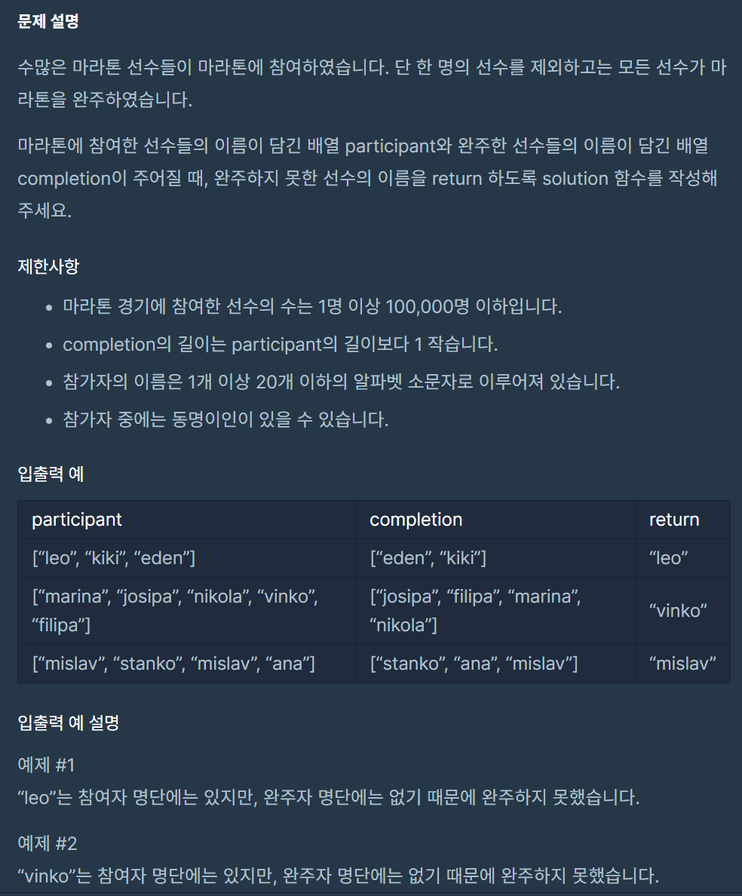
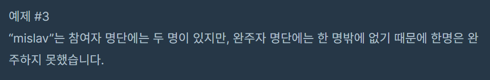

## 문제



## 내 풀이  
```java
import java.util.*;
class Solution {
    static Map<String, Integer> participantMap;
    public String solution(String[] participant, String[] completion) {
        participantMap = new HashMap<String, Integer>();
            
        setMap(participant);        
        matchCompletion(completion);
        String answer = getFailedName();
        
        return answer;
    }
    static void setMap(String[] name){
        for(int i =0; i<name.length; i++){
             if(participantMap.containsKey(name[i])){
                 participantMap.put(name[i],participantMap.get(name[i])+1);
             }else{
                 participantMap.put(name[i],1);
             }
        }
    }
    
    static void matchCompletion(String[] name){
        for(int i =0; i<name.length; i++){
            participantMap.put(name[i],participantMap.get(name[i])-1); 
        }
    }
    
    static String getFailedName(){
        String rtn = "";
        for(String key :participantMap.keySet()){
            if(participantMap.get(key)!=0) return rtn=key;
        }
        return rtn;
    }
}

```
