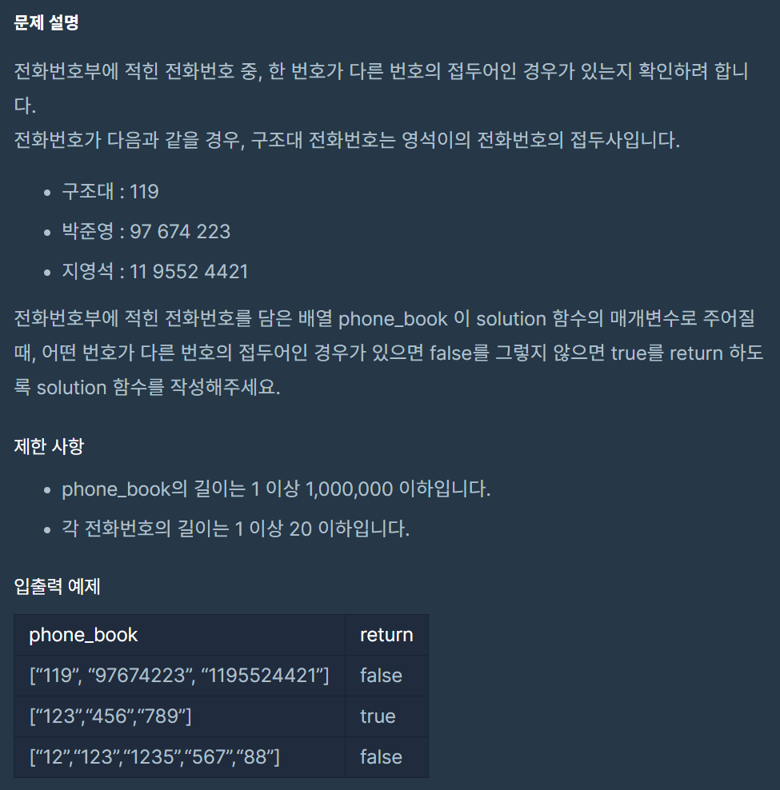

## 문제
  

## 내 풀이  
```java
import java.util.*;
class Solution {
    static Set<String> book;
    public boolean solution(String[] phone_book) {
        book = new HashSet<String>();
        boolean answer = true;
        
        for(int i =0; i<phone_book.length; i++){
            String phoneNum = phone_book[i];
            if(!answer) break;
            if(book.isEmpty()) {
                book.add(phoneNum);
                continue;
            }
            for(String key:book){
                if(key.indexOf(phoneNum)==0||phoneNum.indexOf(key)==0){
                    answer = false;
                    break;
                }
            }
            book.add(phoneNum);
            
        }
        
        return answer;
    }
    
}

```
