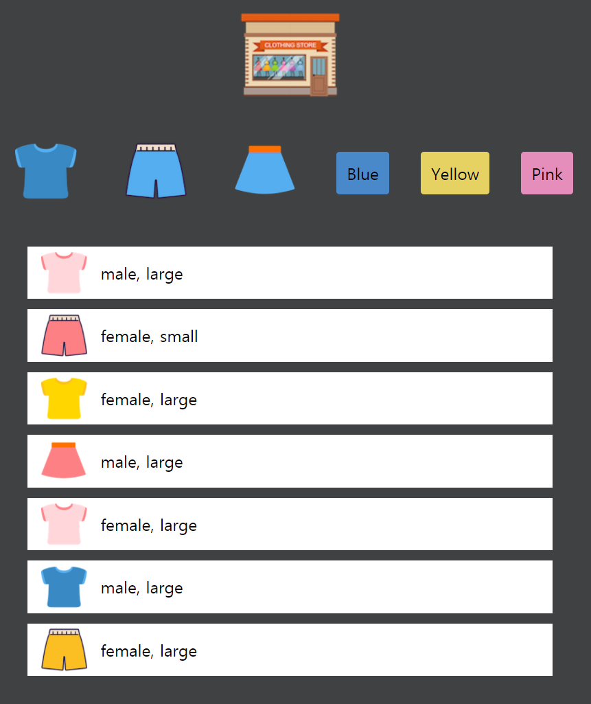

## 드림 코딩 - 쇼핑몰 미니 게임  

1. 구현 사항
   - UI 틀 구현
   - JSON 데이터 받아와서 동적으로 리스트 구성
   - 헤더, 네브바의 아이템을 누르면 리스트 필터 기능 구현

2. 완성본  
<!--{: width="10" height="10"}-->
    
  
출처 : https://academy.dream-coding.com/
  
