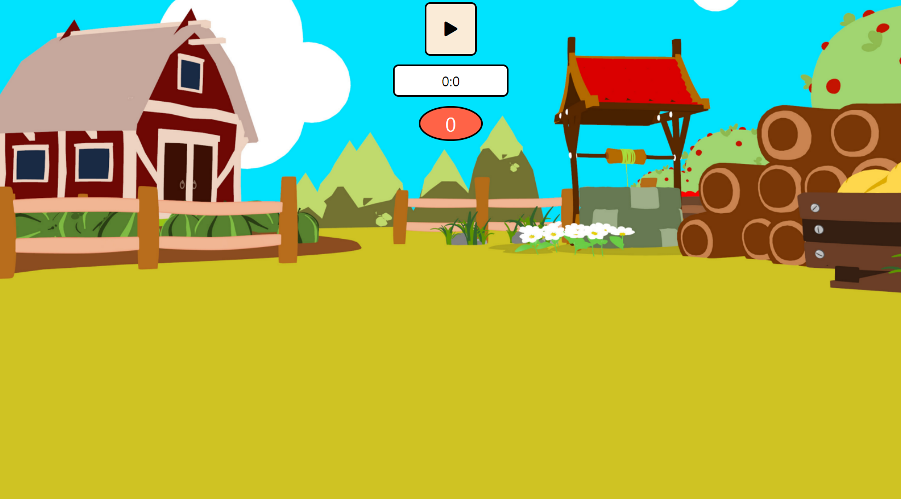
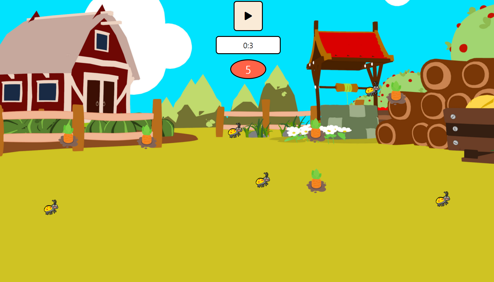
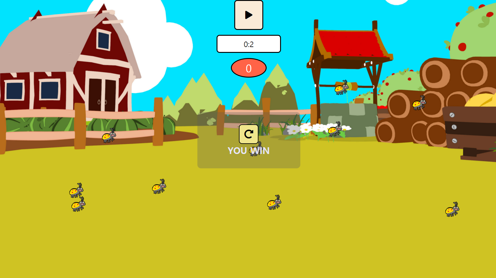
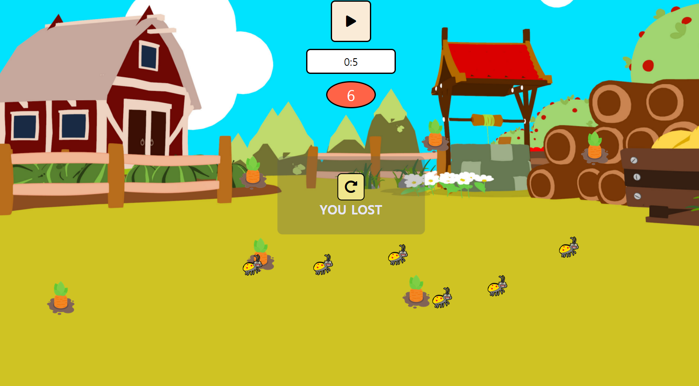

## 드림 코딩 - 게임 구현

1. 구현 사항

- UI 구현
- EVENT 구현

2. 게임 동작

- Start 버튼 누르면 게임 시작  
   
- 카운트다운이 0이 되기 전 모든 당근을 누르기!  
   

  모든 당근을 누르면 WIN!  
   

  벌레를 누르거나 카운트다운이 0이 되면 LOSE  
   

  출처 : https://academy.dream-coding.com/
